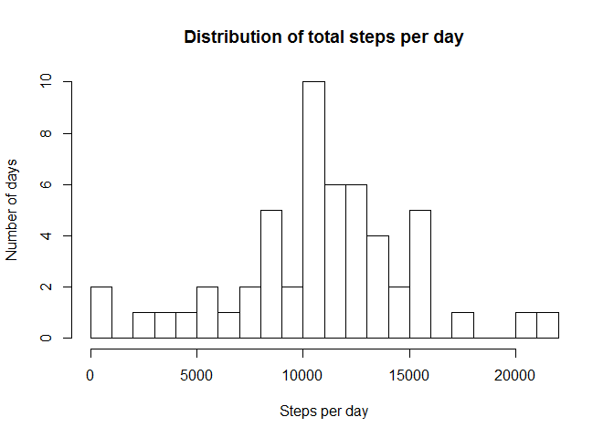
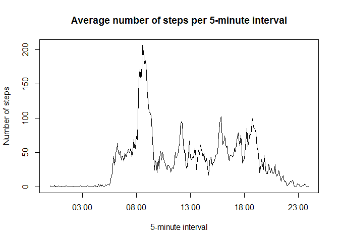
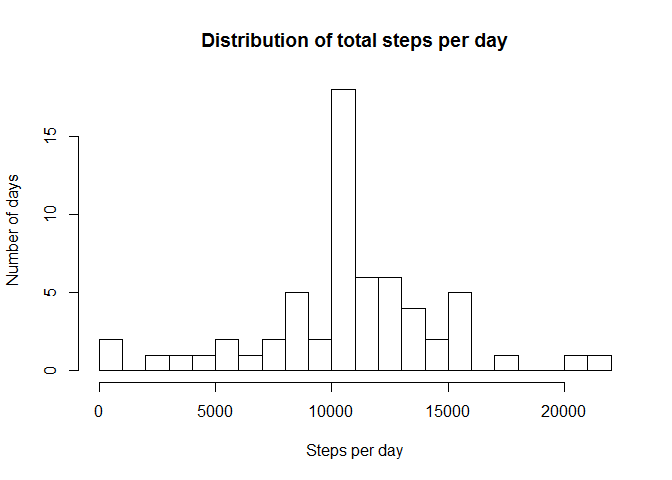
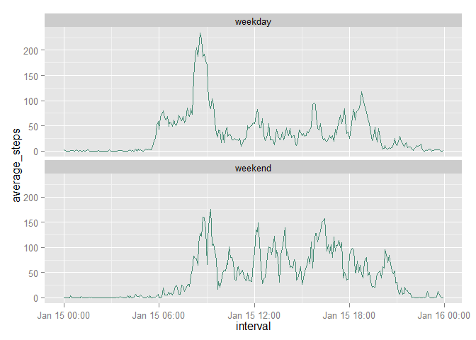

# Reproducible Research: Peer Assessment 1


## Loading and preprocessing the data

First, unzip, load, and preprocess the data.  This code assumes that your R working directory has been set to the top-level of the git repository for the assignment.

The biggest preprocess step is to convert the interval value, which is an integer that represents an hour:minute time, into type POSIXct.  Because the interval values all contain only hour and minute, the conversion will add on the current day to make a complete date-time object.  This is a little awkward, but won't affect the calculatons.


```r
unzip("activity.zip")
activity <- read.csv("activity.csv")

# Convert the 'date' column into type Date
activity$date <- as.Date(activity$date)

# Convert the interval values into POSIXct
activity$interval <- as.POSIXct(sprintf("%04d", activity$interval), format="%H%M")
```

## What is mean total number of steps taken per day?
First, we'll get the total number of steps for each day, as well as the mean and median values.  Note the the median and mean are nearly identical.

```r
library(plyr)
steps_per_day <- ddply(activity, "date", summarize, total_steps=sum(steps))
step_summary <- summary(steps_per_day$total_steps)
print(step_summary[c("Mean", "Median")])
```

```
##   Mean Median 
##  10770  10760
```


Now let's create a histgram showing the distribution of steps-per-day.

```r
hist(steps_per_day$total_steps, breaks=25, main="Distribution of total steps per day", xlab="Steps per day", ylab="Number of days")
```

 


## What is the average daily activity pattern?
Now, we group the original data by 5-minute interval, and calculate the average number of steps for each 5-minute interval.  We then plot the results to look for patterns in the average number of steps per 5-minute interval.

```r
steps_per_interval <- ddply(activity, "interval", summarize, average_steps=mean(steps, na.rm=T))

plot(steps_per_interval$interval, steps_per_interval$average_steps, type="l", main="Average number of steps per 5-minute interval", ylab="Number of steps", xlab="5-minute interval")
```

 

It looks like there is a large spike somewhere around 8 am.  Let's see which interval contains the maximum number of average steps.

```r
max_interval <- steps_per_interval[which.max(steps_per_interval$average_steps), "interval"]
max_row_str <- strftime(max_interval, format="%H:%M")
print(max_row_str)
```

```
## [1] "08:35"
```

It looks like the maximum average steps per 5-minute interval, averaged over all days, starts at 08:35.  Way to go morning exercisers!

## Imputing missing values
How many rows in this data set are missing values?

```r
num_missing <- sum(!complete.cases(activity))
print(num_missing)
```

```
## [1] 2304
```

Let's fill in those missing values by replacing them with the average number of steps for each missing value's interval.

```r
# First, fill a new column with the average steps for each row's interval
activity$filled_steps <- steps_per_interval[match(activity$interval, steps_per_interval$interval), "average_steps"]

# Now, any row that has a valid 'steps' value with put that value into 'filled_steps'
activity[!is.na(activity$steps), "filled_steps"] <- activity[!is.na(activity$steps), "steps"]
```

Now that we have our new column, let's make a new histogram and calculate a new mean and median for average total steps per day.

```r
filled_steps_per_day <- ddply(activity, "date", summarize, total_steps=sum(filled_steps))
filled_step_summary <- summary(filled_steps_per_day$total_steps)
print(step_summary[c("Mean", "Median")])
```

```
##   Mean Median 
##  10770  10760
```

```r
hist(filled_steps_per_day$total_steps, breaks=25, main="Distribution of total steps per day", xlab="Steps per day", ylab="Number of days")
```

 

The mean and median values are totally unchanged, however, the histogram looks fatter in the middle; there are more values clustered around the mean/median of the data.  This should not be surprising, as we just added over 2000 values that are, by definition, close to the mean/median, so we shouldn't expect the values to change.

## Are there differences in activity patterns between weekdays and weekends?
Let's add a factor variable indicating whether a given measurement happened on a weekday or not.

```r
weekends <- c("Saturday", "Sunday")
activity$weekday <- as.factor(ifelse(weekdays(activity$date) %in% weekends, "weekend", "weekday"))
```

Now we'll calculate the average number of steps per interval, for weekends and weekdays.

```r
library(ggplot2)
steps_per_interval <- ddply(activity, c("weekday", "interval"), summarize, average_steps=mean(steps, na.rm=T))
ggplot(steps_per_interval, aes(interval, average_steps))+geom_line(color="aquamarine4")+facet_wrap(~weekday, nrow=2)
```

 

Looks like there are some noticeable differences between weekday and weekend step patterns.  Weekdays tend to have a large spike around 8am.  Weekends, while lacking such a large spike, have a higher average number of steps, on average.
